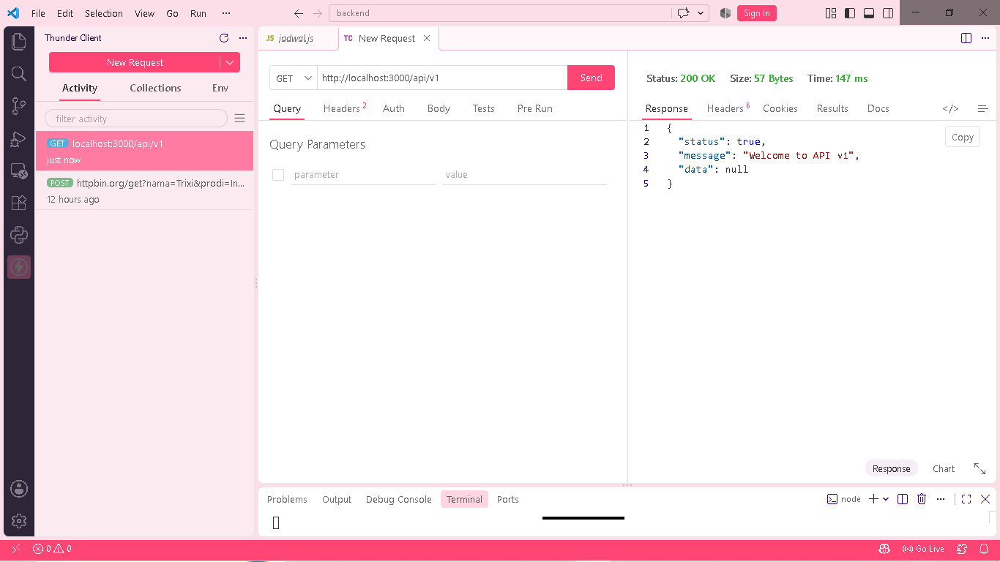

## tabel pengujian
|No|Request|Harapan|Hasil Aktual|
|---:|---|---:|---|
|1|GET /api/v1|Mendapatkan respons 200 dengan pesan selamat datang dari API|Server memberikan respons 200 OK dengan status true dan pesan "Welcome to API v1"|
|2|GET /api/v1/jadwal?status=aktif|Menampilkan daftar jadwal yang memiliki status aktif|Respons 200 OK diterima dengan status true dan hanya menampilkan jadwal berstatus aktif|
|3|GET /api/v1/jadwal/abc|Menghasilkan error 400 karena ID yang diberikan bukan berupa angka|Server merespons 400 Bad Request dengan status false dan memberikan informasi bahwa ID harus berupa angka|
|4|GET /api/v1/jadwal/99|Mengembalikan status 404 karena data jadwal dengan ID tersebut tidak tersedia|Server memberikan respons 404 Not Found dengan status false dan pesan "Jadwal tidak ditemukan"|
|5|POST /api/v1/jadwal dengan body valid|Data jadwal baru berhasil dibuat dan mendapatkan respons 201|Server mengembalikan 201 Created dengan status true dan jadwal "Keamanan Aplikasi" berhasil ditambahkan|
|6|GET /api/v1/jadwal/1/peserta|Menampilkan seluruh peserta yang terdaftar pada jadwal dengan ID 1|Respons 200 OK diterima dengan status true dan menampilkan peserta jadwal 1, yaitu Alya dan Bima|
|7|GET /api/v1/jadwal/1/peserta/103|Mengembalikan status 404 karena peserta tersebut tidak terdaftar pada jadwal 1|Server memberikan respons 404 Not Found dengan status false dan informasi bahwa peserta tidak ditemukan pada jadwal tersebut|
|8|GET /api/v1/alamat-salah|Menampilkan respons 404 ketika endpoint yang diminta tidak tersedia|Server mengembalikan 404 Not Found dengan status false serta pesan bahwa route GET /api/v1/alamat-salah tidak ditemukan|

## bukti screenshoot
## 1.

## 2.

## 3.

## 4.

## 5.

## 6.

## 7.

## 8.
