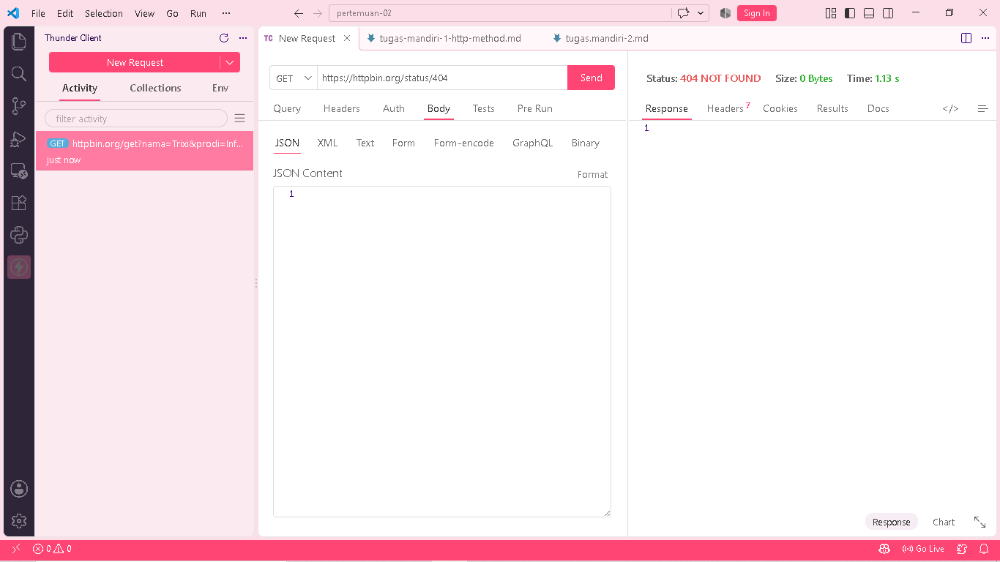

# tugas mandiri 2
## jawaban tugas

### 1. Apa perbedaan 400 dan 404?
400 menandakan request dari client tidak valid atau keliru, 
sedangkan 404 berarti alamat atau resource yang diminta tidak ada di server. 
Sebagai gambaran, error 400 terjadi saat format request salah, 
sementara error 404 muncul saat mencoba mengakses halaman yang tidak tersedia.

### 2. Apa perbedaan 401 dan 403?

401 menandakan kamu belum melakukan autentikasi atau belum menyertakan kredensial yang valid. Sementara itu, 403 berarti server mengenali identitasmu, tetapi kamu tidak memiliki hak akses untuk resource tersebut. Ringkasnya:

401: Belum verifikasi identitas (siapa kamu?).
403: Identitas terverifikasi, tapi akses ditolak (kamu tidak boleh masuk).

### 3. Mengapa 500 menunjukkan masalah pada sisi server?

Kode 500 (Internal Server Error) menandakan bahwa server mengalami kendala internal saat memproses request. Masalah ini murni berasal dari sistem atau sistem pemrosesan di sisi server, bukan karena kesalahan request yang dikirim oleh client.

### 4. Apakah semua error HTTP berarti server mengalami kerusakan?

Tidak. Error HTTP tidak selalu menandakan server rusak. Error berkode 4xx (seperti 400 atau 404) umumnya disebabkan oleh kesalahan pada request client atau halaman yang dicari tidak ada. Hanya error berkode 5xx (seperti 500) yang menunjukkan adanya masalah atau kendala teknis pada sisi server.

## table pengujian
|Status Code|Arti|Hasil Pengujian|Kapan Digunakan|
|---:|---|---:|---|
|200|OK/Berhasil|Permintaan berhasil diproses oleh server|Saat permintaan berhasil dan data dapat diberikan|
|201|Created|permintaan berhasil dan data/resource berhasil dibuat|Saat membuat data baru|
|400|Bad Request|permintaan yang di kirim tidak valid|Saat data atau permintaan dari client salah|
|401|Unauthorized|Client belum melakukan autentikasi yang diperlukan|Saat akses membutuhkan logen atau token tapi belum diberikan|
|403|Forbidden|Server memahami tapi menolak akses|Saat user tidak memiliki izin mengakses resource|
|404|Not Found|Resource atau endpoint yang diminta tidak ditemukan|Saat URL/resource tidak tersedia|
|500|Internal Server Error|Terjadi kesalahan pada sisi server|Server mengalami error saat memproses permintaan|

## screenshoot pengujian
## 200

## 404

