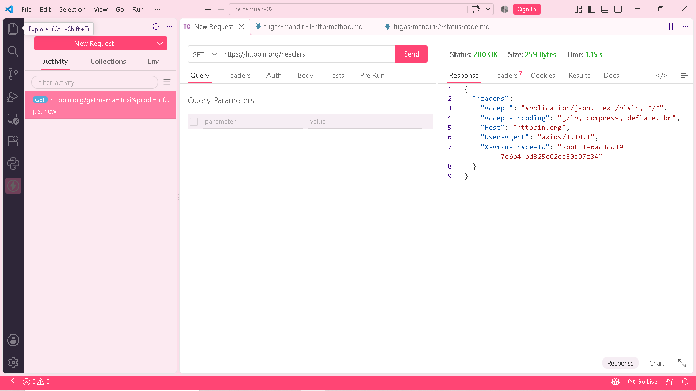
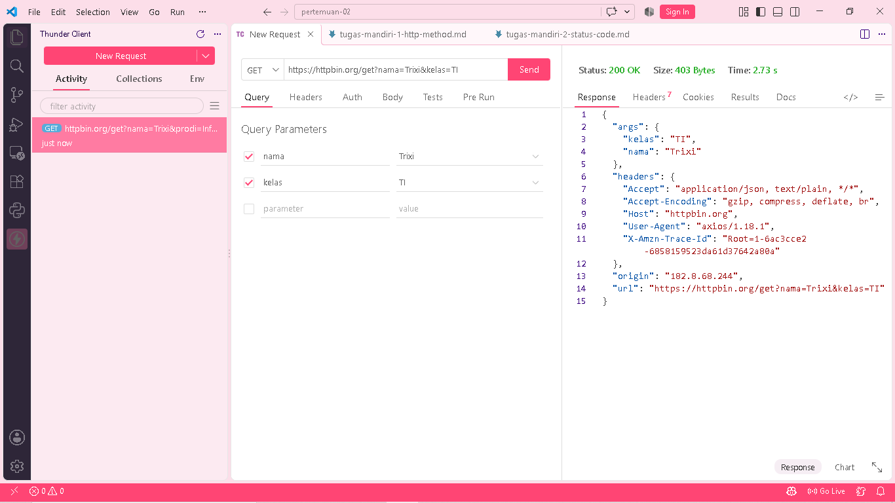

# Tugas Mandiri 3 — Memahami Request dan Response

## A. Pengujian Endpoint `/get`

**Method:** GET

**URL:**

`https://httpbin.org/get?nama=Trixi&kelas=TI`

**Hasil:**

Server mengembalikan informasi request yang dikirim, termasuk query parameter `nama` dan `kelas`, header, URL, dan informasi lainnya.

## B. Pengujian Endpoint `/headers`

**Method:** GET

**URL:**

`https://httpbin.org/headers`

**Hasil:**

Server mengembalikan informasi HTTP header yang diterima dari client, seperti `Accept` dan `User-Agent`.

## C. Jawaban Pertanyaan

### 1. Apa yang dimaksud request?

Request adalah Instruksi atau pesan permintaan yang ditransmisikan oleh client menuju server untuk memperoleh atau memperbarui informasi.

### 2. Apa yang dimaksud response?

Response adalah Umpan balik yang dihasilkan oleh server sebagai hasil pemrosesan terhadap request client.

### 3. Apa fungsi query parameter?

Pasangan kunci-nilai pada struktur URL yang berfungsi menyertakan parameter data tambahan (seperti nama=Trixi & kelas=TI).

### 4. Apa fungsi HTTP header?

Komponen metadata pada protokol HTTP yang memuat informasi tambahan terkait transaksi request maupun response (contoh: format dokumen dan autentikasi client).

### 5. Apa perbedaan data pada URL dengan data pada request body?

Data pada URL terekspos secara terbuka di dalam string alamat web melalui query parameter. Sebaliknya, data request body terenkapsulasi di dalam muatan (payload) request, yang umumnya digunakan pada metode HTTP seperti POST, PUT, dan PATCH.

##  screenshoot pengujian

### get Headers

### get nama

